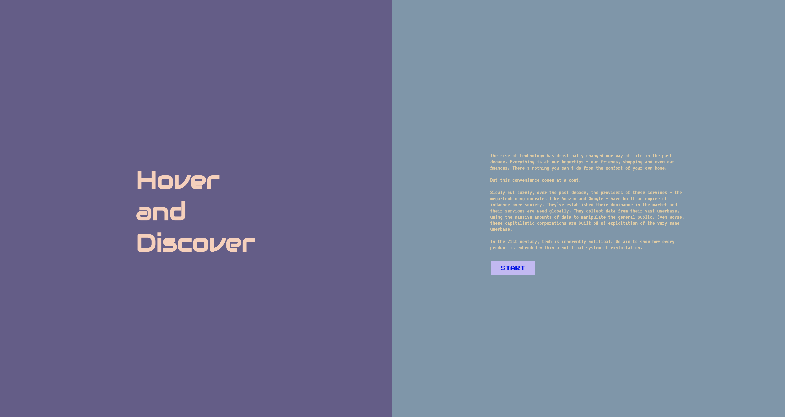

# Hover and Discover 

## Project Overview

Hover and Discover is a web page that aims to raise awareness about the dominance of tech moguls in the production of technology most people rely on every day. By displaying a visual graphic of a normal living space, under the presumption that the average user living space will resemble the one displayed, the user is prompted to identify pieces of technology interspersed in this space, upon the clicking of which, a prompt is displayed to reveal a fact about a major tech company known for the manufacturing of the particular product. The facts revealed will hopefully have the user think critically and ethically about our current dependency on these tech moguls who dominate the tech industry and are powerful enough to use their control in egregiously reprehensible ways. 

## Project Idea

Visiting topics across the semester such as surveillance, big data, and labor all synergistically led to the generation of the idea behind the project. Observing the current status of the tech industry, where large tech conglomerates reign supreme over all aspects of the digital space, the virtual world is rife with instances of systemic exploitation of both labor and data as well as an unsettling amount of capitalistic surveillance. Because of how integrated technology has become in all aspects of our modern reality, our senses seize to tingle in the face of this dominance in the ethical and analytical sense. Hover and Discover is our attempt to have the user realize the breadth of power that we have vested in these conglomerates – by hovering over a piece of technology, the user discovers some facts about a major conglomerate exploiting labor, exercising unreasonable amounts of surveillance, and racking up an immeasurable amount of user data. As much as we think we know about what these conglomerates do and how they treat their database, their user base, and the labor they employ, we do not know enough about the details – and the devil is almost always in the details.Our project is a small attempt to shed light on some of those details.

## Project Objective 

Our ultimate goal behind this project is to increase our users’ awareness of the degree of infiltration and grip tech conglomerates have over the internet: a space initially conceived with democratic values of freedom, unrestrained entry and participation, and privacy protection in mind. Hopefully, some of this awareness could be channeled into galvanized action to revive and reinforce these founding democratic principles of the digital space.  
 
## Implementation

### Research 
Our research started by examining our own living spaces and identifying key technology we usually equip our living space with. From there, we pinpointed specific key conglomerates known for the production of each key technology and researched how these conglomerates behaved in the context of labor, big data collection, and exercise of capitalistic surveillance.

### Graphics
We used Adobe Photoshop for most of the graphical elements of the living space, with the aid of royalty-free, non-commercial images from the internet. Other design elements were created with HTML and CSS. 

### Code 
We used HTML, CSS, and some Javascript for the design of the website and the p5.js library for the interactivity of hovering and displaying prompts and we host the website on GitHub Pages. 

